Shopping App

Ứng dụng mua sắm di động được xây dựng bằng Flutter, tích hợp thanh toán qua Stripe, hệ thống chat trực tiếp giữa người dùng và admin, cùng nhiều tính năng khác.

Tính năng chính

Người dùng
- Đăng ký & Đăng nhập: Tạo tài khoản mới hoặc đăng nhập với email và mật khẩu
- Duyệt sản phẩm: Xem sản phẩm theo danh mục, tìm kiếm sản phẩm bằng từ khóa
- Chi tiết sản phẩm: Xem thông tin chi tiết, hình ảnh và giá sản phẩm
- Giỏ hàng: Thêm sản phẩm vào giỏ hàng, điều chỉnh số lượng, xóa sản phẩm
- Thanh toán: Thanh toán đơn hàng qua Stripe
- Mã giảm giá: Áp dụng mã giảm giá khi thanh toán
- Quả`n lý đơn hàng: Xem trạng thái và lịch sử đơn hàng
- Thông báo: Nhận thông báo về đơn hàng và cập nhật
- Chat với Admin: Trò chuyện trực tiếp với admin để được hỗ trợ
- Hồ sơ cá nhân: Quản lý thông tin cá nhân

Admin
- Quản lý sản phẩm: Thêm, sửa, xóa sản phẩm
- Quản lý đơn hàng: Xem và cập nhật trạng thái đơn hàng
- Quản lý người dùng: Xem danh sách người dùng
- Quản lý mã giảm giá: Tạo và quản lý mã giảm giá
- Chat với người dùng: Trả lời tin nhắn từ người dùng
- Xử lý yêu cầu hoàn tiền: Quản lý các yêu cầu hoàn tiền từ người dùng

Yêu cầu hệ thống
- Flutter SDK 3.24.0 trở lên
- Dart SDK 3.3.0 trở lên
- Android Studio hoặc VS Code
- Firebase account
- Stripe account

Cài đặt
1. Cài đặt Flutter
Nếu bạn chưa cài đặt Flutter, hãy làm theo hướng dẫn tại trang chính thức của Flutter.

2. Clone repository

3. Cài đặt các dependencies
    flutter pub get

4. Cấu hình Firebase
Tạo một dự án Firebase mới tại Firebase Console
Thêm ứng dụng Android và iOS vào dự án Firebase
Tải file cấu hình google-services.json và đặt vào thư mục  android/app
Tải file cấu hình GoogleService-Info.plist và đặt vào thư mục  ios/Runner
Kích hoạt các dịch vụ Firebase sau:
Authentication (Email/Password)
Cloud Firestore
Storage

5. Cấu hình Stripe
Tạo tài khoản tại Stripe Dashboard
Lấy Publishable key
Thay thế key trong file  lib/main.dart:
Stripe.publishableKey = "pk_test_51RPcK7CrdiAruMyrzDn1P7rG9cpU4oiEblmxvu8NaGqojPJim3266dMKKYlg6s6mZbCyrE5HyMkiBO0D7cygWJIg00ciOGJswd";

Chạy ứng dụng
Chế độ debug
    flutter run

Chế độ release
    flutter build apk
    flutter build ios

Lưu ý quan trọng
Cấu hình Stripe: Đảm bảo thay thế Publishable key của Stripe trong file  lib/main.dart bằng key của bạn.
Cấu hình Firebase: Đảm bảo tạo đúng cấu trúc Firestore Database với các collection sau:
Users: Lưu thông tin người dùng
Products: Lưu thông tin sản phẩm
Categories: Lưu các danh mục sản phẩm
Orders: Lưu thông tin đơn hàng
Carts: Lưu thông tin giỏ hàng
DiscountCodes: Lưu thông tin mã giảm giá
Chats: Lưu tin nhắn chat giữa người dùng và admin
Notifications: Lưu thông báo cho người dùng
Admin: Lưu thông tin tài khoản admin
Quyền truy cập Storage: Cấu hình quyền truy cập Firebase Storage để lưu trữ hình ảnh sản phẩm và avatar người dùng.
Tài khoản demo
Admin
Username: admin
Password: admin123

## UI Demo

### Customer Interface

| Home Page | Product Details |
|---|---|
|  | 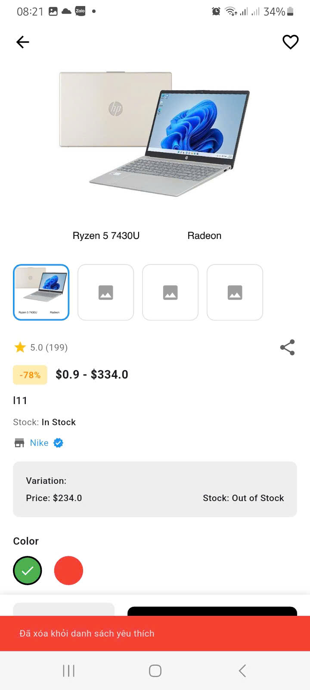 |

| Profile | Chat with admin |
|---|---|
| 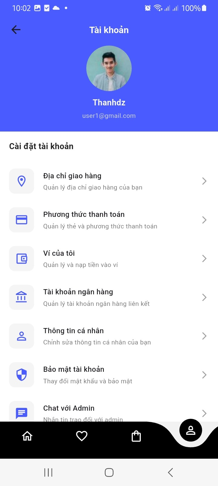 | 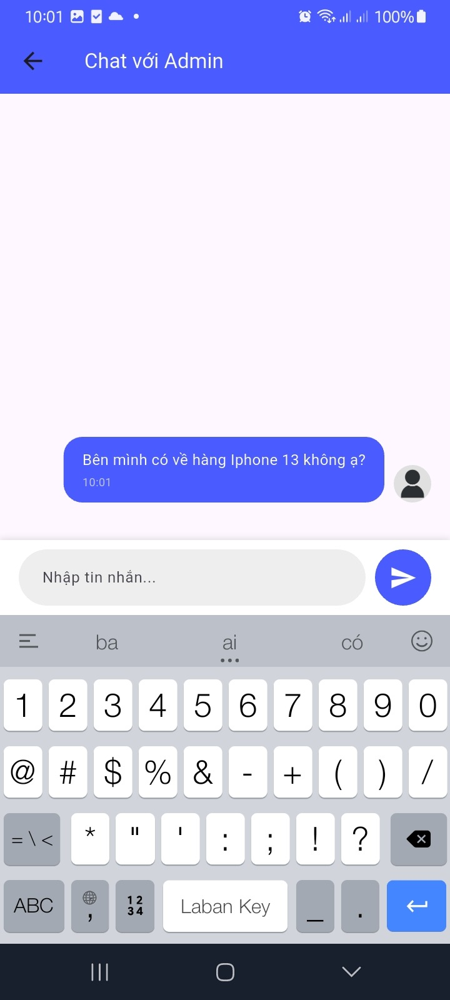 |

| Search Page | Wishlist |
|---|---|
| 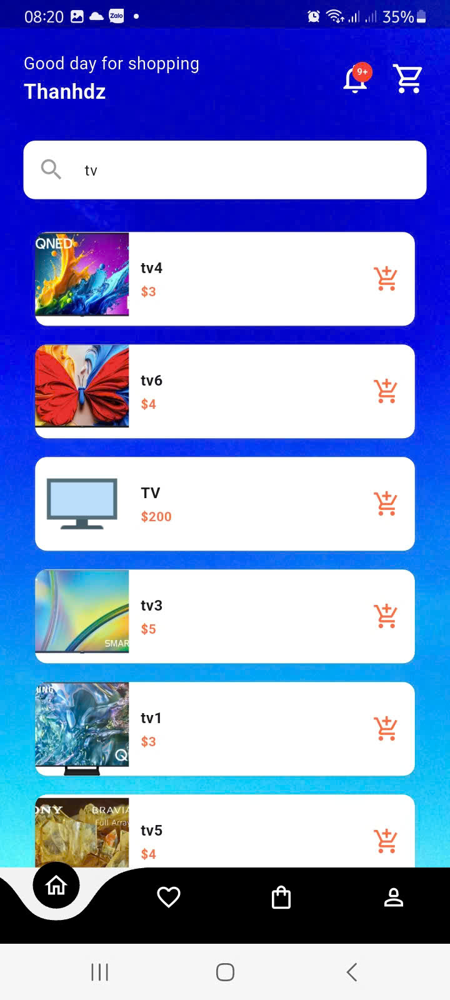 | 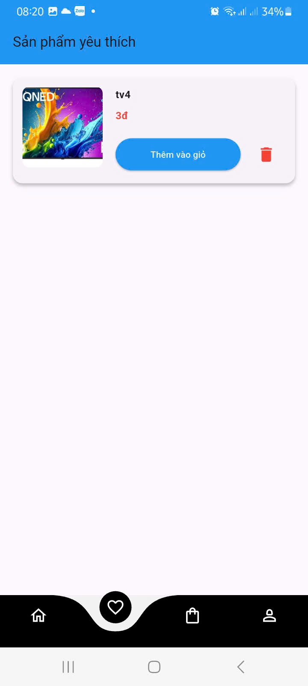 |

| Wallet | Add money |
|---|---|
|  | 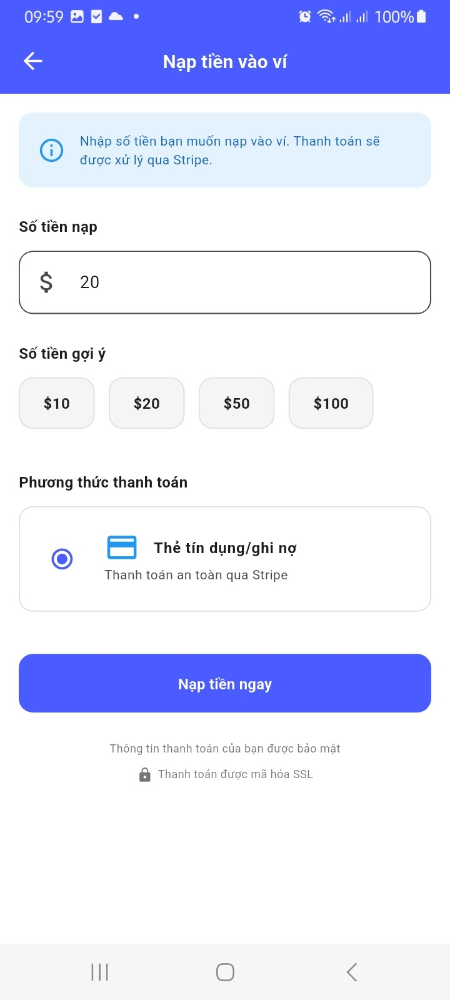 |

| Checkout | Stripe |
|---|---|
| 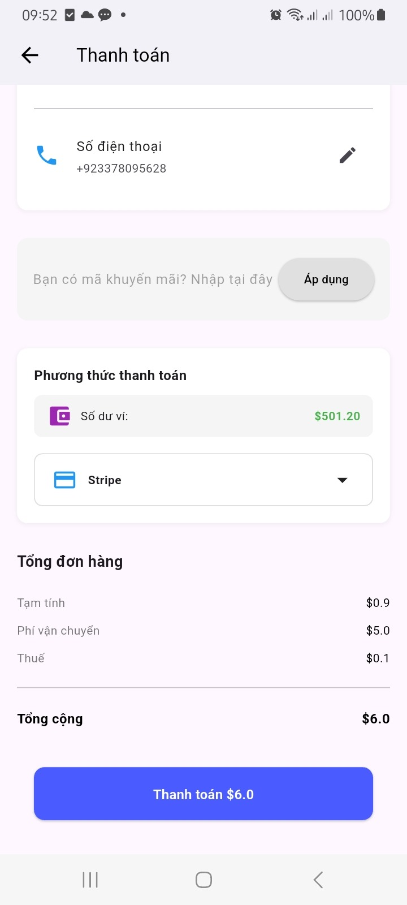 | 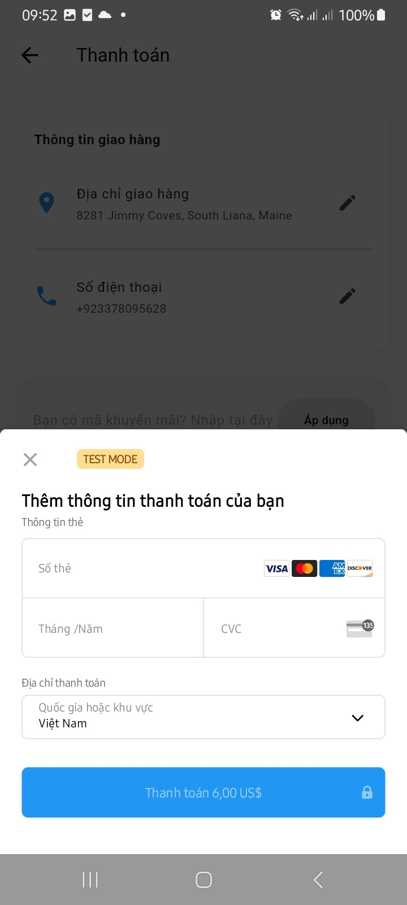 |

| Order | Refund request |
|---|---|
| 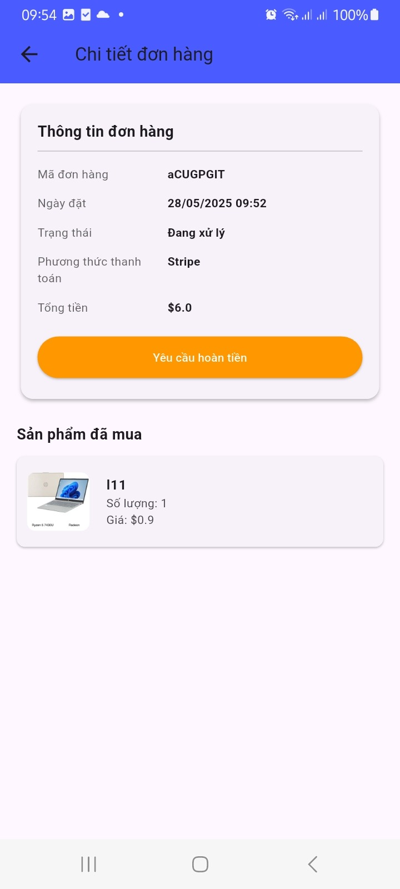 | 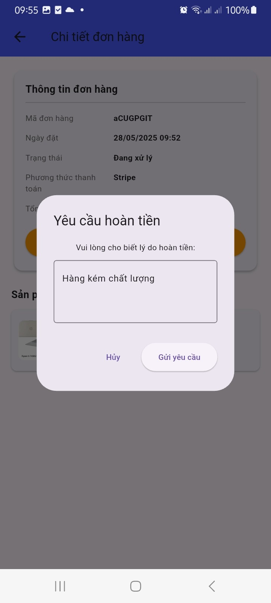 |

ADMIN

| Admin home | Chat management |
|---|---|
| 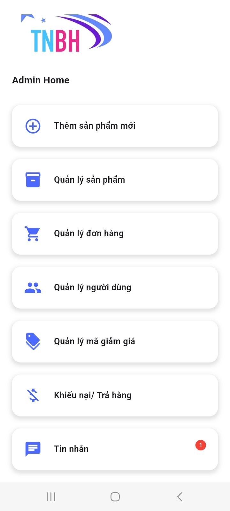 |  |

Order management
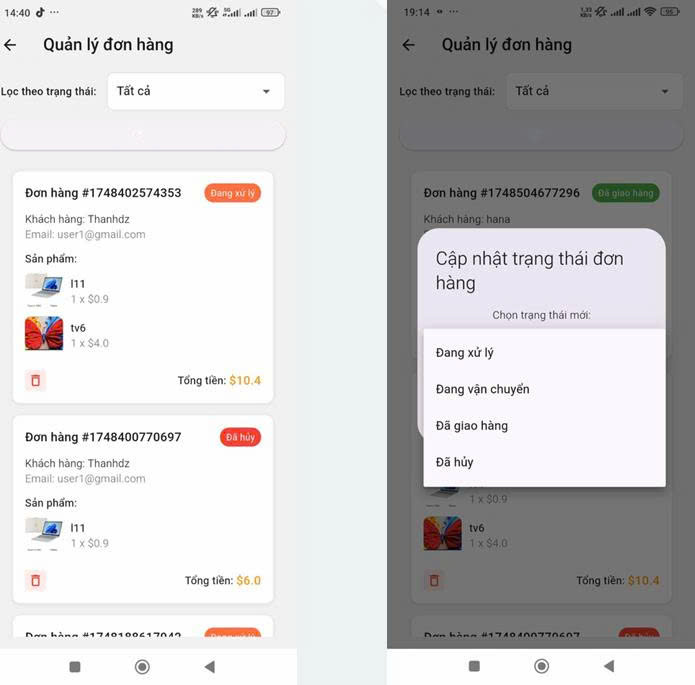

Refund Management
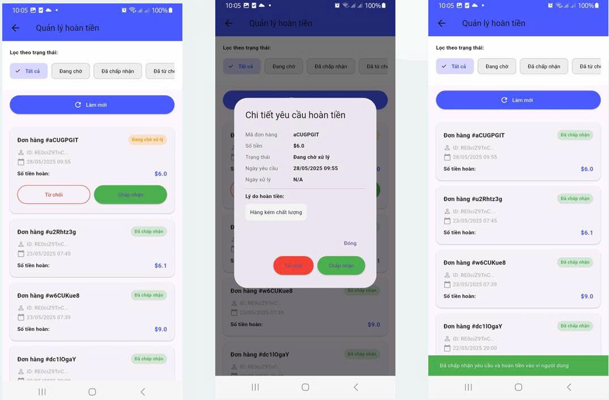

Products Management
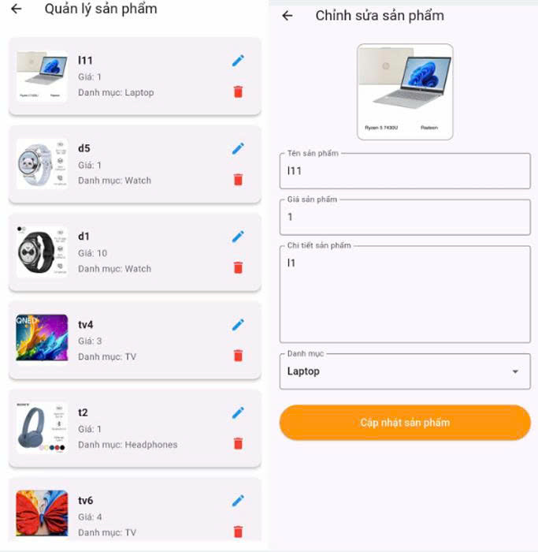

Users Management
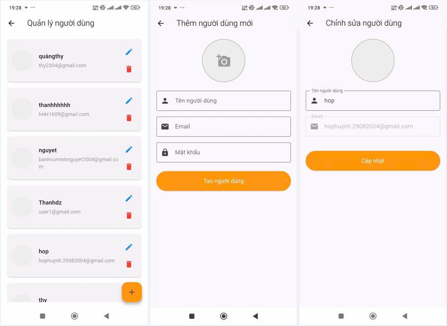

Coupon Management
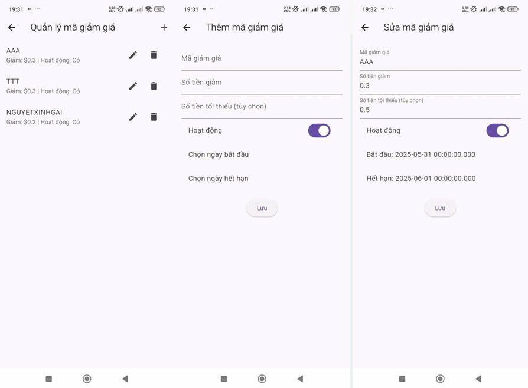